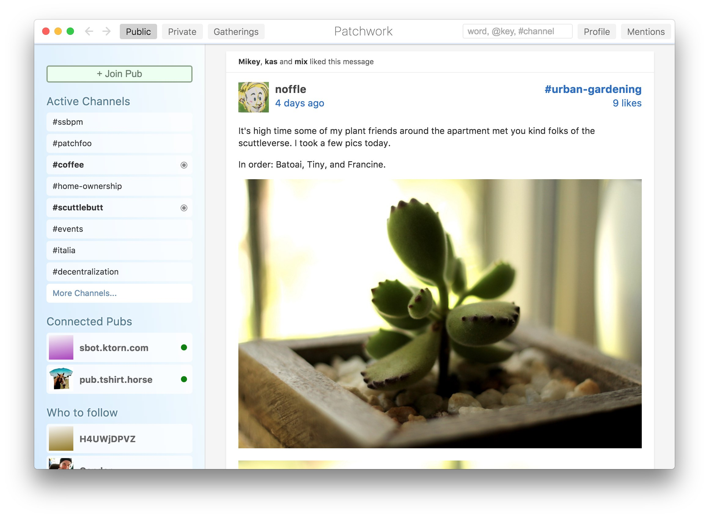

<h1 align="center">
  
  <br />
  Patchwork
</h1>

<h4 align="center">
  A decentralized messaging and sharing app built on top of Secure Scuttlebutt (SSB).
</h4>



<details>
  <summary>Table of Contents</summary>
  <li><a href="#features">Features</a></li>
  <li><a href="#pubs">Pubs</a></li>
  <li><a href="#install">Install</a></li>
  <li><a href="#docs">Docs</a></li>
</details>

## Features

It's better than email because:

 - Private messages are end-to-end encrypted, always.
 - You have to follow somebody to get messages from them, so you won't get spammed.
 - Your mail can be public broadcasts or private, and you'll only see replies by people you follow.
 - The datastructure is a global mesh of append-only logs, which can support new types of data (not just "mail").
 - Users are not bound to one server/host (what we call "Pubs") and do not have to trust the servers.
 - It's very easy to setup and maintain your own Pub.

It's better than Twitter and Facebook because:

 - Private messages are end-to-end encrypted, always.
 - The software runs on your device, so there's nobody tracking your browsing.
 - The application code is FOSS, so you're free to fork or write new applications without a gatekeeper setting terms.
 - Data is saved to your disk, and so the application works offline.
 - You can sync directly with friends over Wi-Fi.

## Pubs

In order to gossip outside your local network, you'll need to connect to a [Pub](https://www.scuttlebutt.nz/concepts/pub.html).

You can find an invite to an available pub at the [Pub servers registry](https://github.com/ssbc/scuttlebot/wiki/Pub-Servers).

Get an invite, then in `patchwork`: click "+ Join Pub" and paste the invite code.

This will cause you to follow the Pub and vice versa. If you haven't synchronized to this social network yet, prepare to wait a few minutes while your local server synchronizes.

## Install

### Download installers for Windows, macOS and Linux

See [patchwork/releases](https://github.com/ssbc/patchwork/releases)

### Or build from source

With node (>= 4) and npm (>= 3) installed:

```shell
$ git clone https://github.com/ssbc/patchwork
$ cd patchwork
$ npm install
$ npm start
```

You'll need some more dependencies to build.

On Debian Linux:

```shell
sudo apt-get install g++ m4 libtool automake libgconf-2-4   # build tools
sudo apt-get install libxext-dev libxtst-dev libxkbfile-dev # spellchecker headers
```

On Fedora Linux:

```shell
sudo dnf install libXext-devel libXtst-devel libxkbfile-devel gcc-c++ m4 automake libtool
```

On macOS:

```shell
brew install libtool automake # build tools
```

## Code of conduct

Please note that this project is released with a [Contributor Code of Conduct](code-of-conduct.md). By participating in this project you agree to abide by its terms.

## Contributing

Please read the [Patchwork Contribution Guidelines](contributing.md) before opening a pull request.

## Docs

- [scuttlebutt.nz](https://www.scuttlebutt.nz)
- [scuttlebot.io](https://scuttlebot.io)
