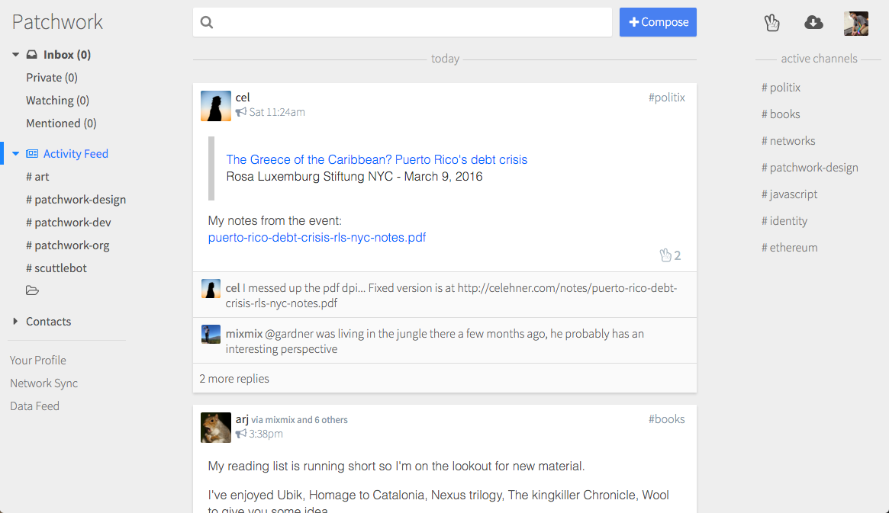

# Patchwork

**Patchwork is a decentralized messaging and sharing app.**

It's better than email because:

 - Private messages are end-to-end encrypted, always.
 - You have to follow somebody to get messages from them, so you won't get spammed.
 - Your mail can be public broadcasts or private, and you'll only see replies by people you follow.
 - The datastructure is a global mesh of append-only logs, which can support new types of data (not just "mail").
 - Users are not bound to one server/host (what we call "pubs") and do not have to trust the servers.
 - It's very easy to setup and maintain your own pub.

It's better than twitter and facebook because:

 - Private messages are end-to-end encrypted, always.
 - The software runs on your device, so there's nobody tracking your browsing.
 - The application-code is FOSS, so you're free to fork or write new applications without a gatekeeper setting terms.
 - Data is saved to your disk, and so the application works offline.
 - You can sync directly with friends over the wifi. 

Because we're still in development, **you'll need to contact an SSB team member (in #scuttlebutt on Freenode) to get onto the network!**
That's our informal barrier to entry right now, since we're not prepared for lots of users yet.

Patchwork embeds the [Scuttlebot networked database](https://github.com/ssbc/scuttlebot), so if you're running Patchwork, you don't need to run another scuttlebot server.

## [Install Instructions](./docs/install.md)

## Docs

- [Help / FAQ](./docs/help-faq.md)
- [Building Patchwork](./docs/BUILDING.md)
- [Creating a Testing Environment, and Running Tests](./docs/TESTING.md)
- [Patchwork Project Structure](./docs/PROJECT-STRUCTURE.md)
- [SSB Docs Repo](https://github.com/ssbc/docs)

## License

Copyright (C) 2015-2016 Secure Scuttlebutt Consortium

This program is free software: you can redistribute it and/or modify
it under the terms of the GNU General Public License as published by
the Free Software Foundation, either version 3 of the License, or
(at your option) any later version.

This program is distributed in the hope that it will be useful,
but WITHOUT ANY WARRANTY; without even the implied warranty of
MERCHANTABILITY or FITNESS FOR A PARTICULAR PURPOSE.  See the
GNU General Public License for more details.

You should have received a copy of the GNU General Public License
along with this program.  If not, see <http://www.gnu.org/licenses/>.
